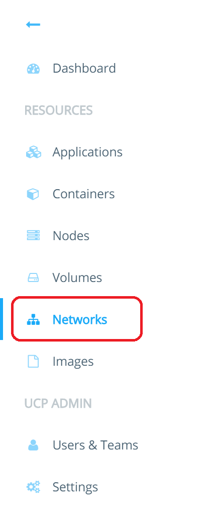
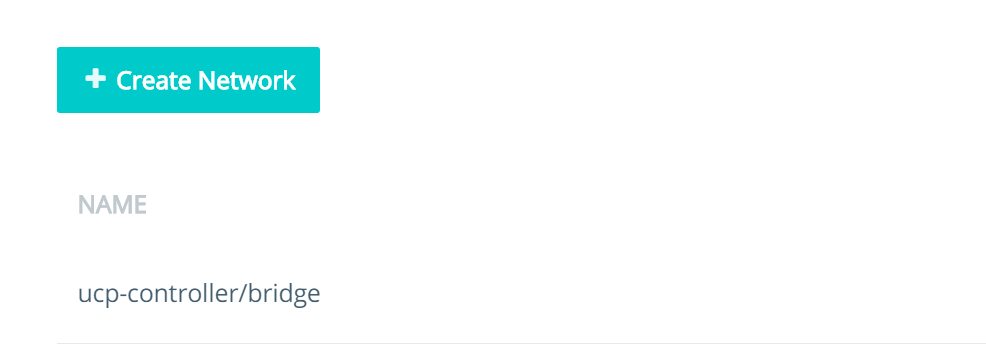
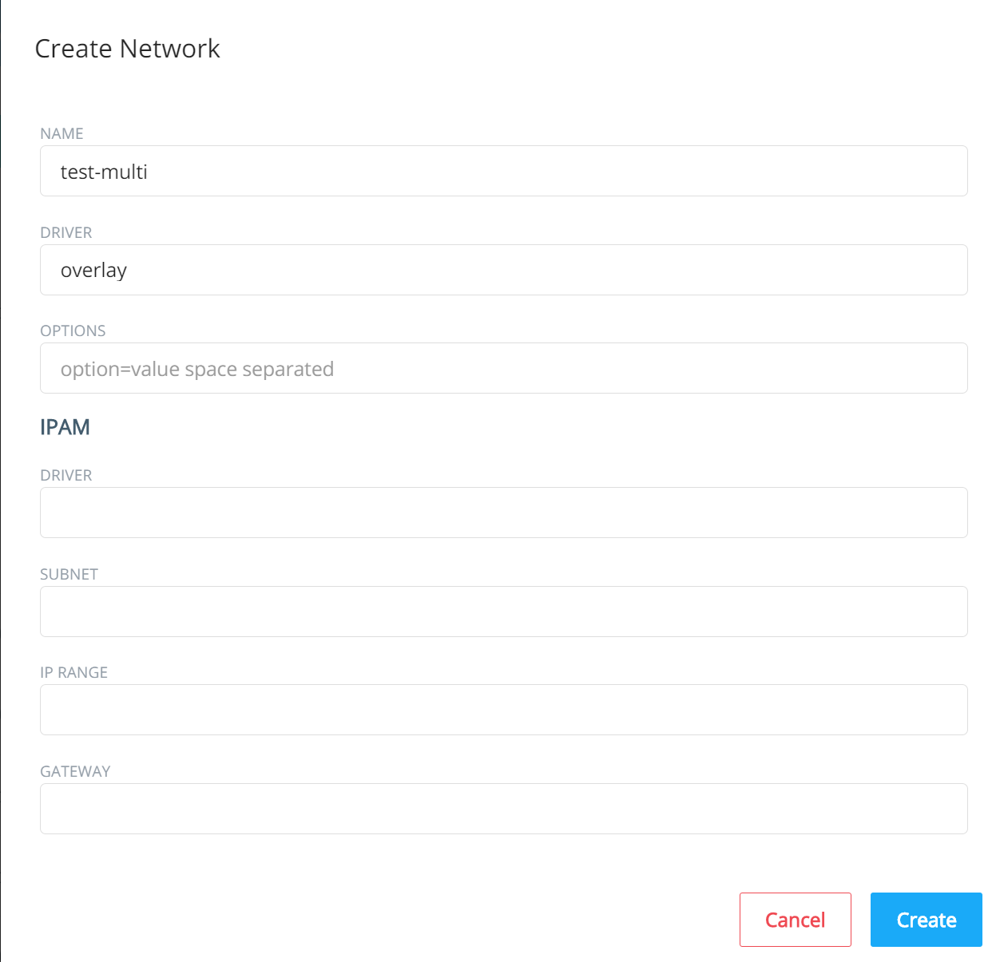
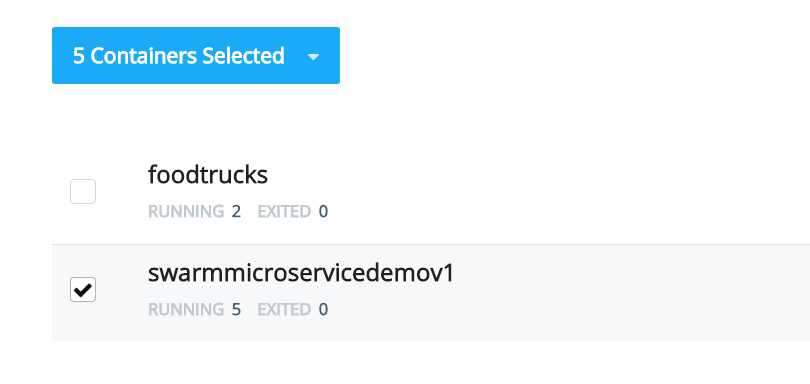
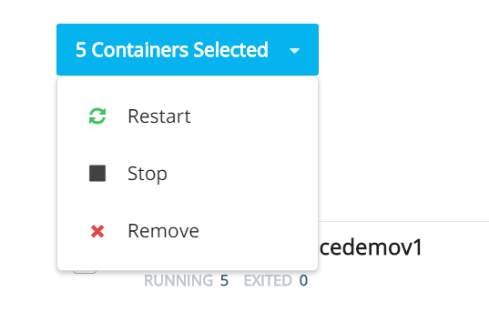
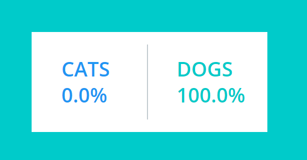

# Task 6 - Deploy Voting App across multiple nodes

## Pre-requisites
- Client bundle downloaded

## Step 1 - Setup multi host networking

As we saw in the previous exercise, We were not able to start our Demo Voting Application. When `Compose` is run against `Swarm / UCP` and our `Compose` file
is in the v2 format, `Compose` will by default create an overlay network for our application. Swarm would then schedule the various services in different nodes
and the services would be able to discover and communicate with each other through this overlay network.

However, an overlay network cannot be created unless our nodes are connected to a discovery service, such as `Consul`, `etcd` or `Zookeeper`. While you can
use any of those options for the Docker Engine, UCP is installed with `etcd` and thus we will use `etcd` for service discovery. 

The `docker/ucp` image we previously used to install UCP and to join UCP nodes, also comes with a `engine-discovery` command that can be used to 
configure the service discovery with `etcd`

1. Run `$ docker run --rm -it --name ucp docker/ucp engine-discovery --help` and have a read of the command and its options.
2. Follow the instructions at [](https://docs.docker.com/ucp/networking/)https://docs.docker.com/ucp/networking/ to setup container networking with UCP
3. At the completion of step 2, you should be able to create an overlay network from the UCP interface. Go to the **Networks** page in the UCP interface and 
   create a new overlay network called `test-multi`
   
   First, click on the **Networks** link on the left navigation
   
   
   
   Then click the **Create Network** button.
   
   
   
   Fill out the form with the following details, then hit **Create**
   
   


## Step 2 - Run Docker Compose

1. Change directory to the Voting Application folder
2. Launch the application with Docker Compose. What can you observe?

   ```
   johnny@JT MINGW64 ~/Documents/GitHub/swarm-microservice-demo-v1 (master)
   $ docker-compose up -d
   Creating swarmmicroservicedemov1_vote-worker_1
   Creating swarmmicroservicedemov1_web-vote-app_1
   unable to find a node that satisfies node==frontend01
   ```
3. Try and identify the cause of the error and edit the `docker-compose.yml` file to fix it.

   Let's take a quick look at the `docker-compose.yml` file
   
   ```
   version: '2'

   services:
     web-vote-app:
       build: web-vote-app
       environment:
         WEB_VOTE_NUMBER: "01"
         constraint:node: "=frontend01"

     vote-worker:
       build: vote-worker
       environment:
         FROM_REDIS_HOST: 1
         TO_REDIS_HOST: 1

     results-app:
       build: results-app

     redis01:
       image: redis:3

     store:
       image: postgres:9.5
       environment:
         - POSTGRES_USER=postgres
         - POSTGRES_PASSWORD=pg8675309
   ```
   
   Notice the line saying `constraint:node: "=frontend01"`. 
   This tells Docker that the service container must be run on a Node called `frontend01`. We don't have such a Node and hence the error message.
   
   This Compose file was written with a development machine in mind as opposed to a production deployment. Hence why each service has a `build` instruction instead
   of an `image` instruction. 
   
   Delete the `constraint:node` line and save the file.
   
3. Once the error has been fixed, launch the application again.
   
   This time there shouldn't be any errors.
   
   **Note** Sometimes, you may run into the following type of error
   
   ```
   409 Conflict: subnet sandbox join failed for "70.28.0.0/16": overlay subnet 10.0.0.0/16 has conflicts in the host while running in host mode
   ```
   
   This is because Compose is trying to create an Overlay network on a subnet that is already being used by the host. This is due to the way AWS allocates
   addresses. If you run into this error, add the following configuration to the end of your `docker-compose.yml` file
   
   ```
   networks:
    default:
      ipam:
        config:
          - subnet: 10.10.10.0/24
   ```
   
## Step 3 - Use a Production ready configuration
 
Our `docker-compose.yml` file didn't necessarily follow the best practices. Ideally you shouldn't build your images when deploying your application. The Compose
file should be running pre-built images from a registry. Remember, developers build the images and push them to the registry, while IT operations runs the images.

1. Delete the Voting Application from the **Applications** page in UCP.  
   
   First, tick the `swarmmicroservicedemov1` application checkbox
   
   

   Then use the dropdown list above and click *remove*
   
   
   
2. Take a look at the Compose file at [](https://github.com/nicolaka/voteapp-base/blob/master/docker-compose.yml)https://github.com/nicolaka/voteapp-base/blob/master/docker-compose.yml

   Compare this to the Compose file in the Voting App repo. What do you notice as the difference?

3. Clone the Voteapp Base repository into a folder on your PC / Mac

   `$ git clone https://github.com/nicolaka/voteapp-base
   
4. Open the `docker-compose.yml` file in the `voteapp-base` folder and change the port mapping of the `voting-app` service. Map port 80 in the container to port 80 on the host.

   To do this, look for the section:
   ```
   voting-app:
     image: docker/example-voting-app-voting-app
     ports:
       - "80"
   ```
   
   Change it to 
   ```
   voting-app:
     image: docker/example-voting-app-voting-app
     ports:
       - "80:80"
   ```
   
   The reason for this is so that as IT operations, we control which ports services are exposed on as opposed to having the port automatically mapped. Also, if 
   we use automatic port mapping, Docker will choose a port that is most likely blocked by AWS, therefore preventing external access to our application.
   
5. Repeat the same procedure, for the `result-app` service. Map port 80 to port 5000
   
6. Launch the application
   
7. Verify that the application containers are scheduled on different nodes.
   
## Step 4 - Test the application

1. Open the `voteappbase_voting-app_1` on your web browser. You should see the following:

   

   This is the web application where we can cast a vote. From our previous screenshot, we can see that the container is on `ucp-node-1`. 
   Also, from our configuration, we can know that the container is available through port 80 on the host. Therefore we just need to 
   input the `ucp-node-1` URL on our web browser to access the application. 
   
2. Cast your vote.

3. Open `voteappbase_result-app_1` on your web browser and see the results of your vote.
   
   You should see the following screen, albeit with a different percentage allocation depending on how you cast your vote.
   
   
   
   
   
