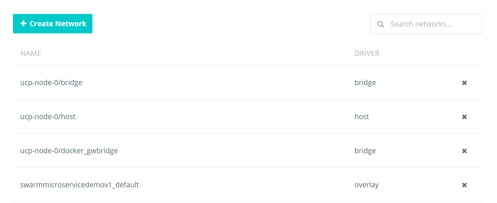
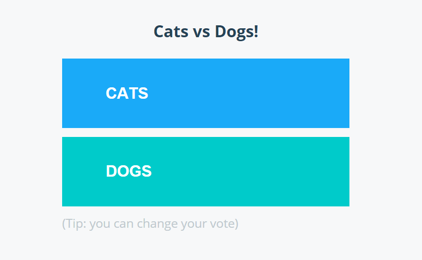

# Task 6 - Deploy Application across multiple nodes

## Pre-requisites
- UCP installed with at least 2 nodes joined
- Client bundle downloaded

## Step 1 - Download the Voting Application

1. Go to https://github.com/docker/swarm-microservice-demo-v1 and read the page to get a high level understanding of the application we are going
   to run.
2. Clone the application repository into a local folder on your machine.
3. Remove all existing applications you have deployed on UCP. 

## Step 2 - Run Docker Compose

1. Change directory to the Voting Application folder
2. Launch the application with Docker Compose. What can you observe?

   ```
   johnny@JT MINGW64 ~/Documents/GitHub/swarm-microservice-demo-v1 (master)
   $ docker-compose up -d
   ...
   ...
   Creating swarmmicroservicedemov1_vote-worker_1
   Creating swarmmicroservicedemov1_web-vote-app_1
   unable to find a node that satisfies node==frontend01
   ```
3. Try and identify the cause of the error and edit the `docker-compose.yml` file to fix it.

   Let's take a quick look at the `docker-compose.yml` file
   
   ```
   version: '2'

   services:
     web-vote-app:
       build: web-vote-app
       environment:
         WEB_VOTE_NUMBER: "01"
         constraint:node: "=frontend01"

     vote-worker:
       build: vote-worker
       environment:
         FROM_REDIS_HOST: 1
         TO_REDIS_HOST: 1

     results-app:
       build: results-app

     redis01:
       image: redis:3

     store:
       image: postgres:9.5
       environment:
         - POSTGRES_USER=postgres
         - POSTGRES_PASSWORD=pg8675309
   ```
   
   Notice the line saying `constraint:node: "=frontend01"`. 
   This tells Docker that the service container must be run on a Node called `frontend01`. We don't have such a Node and hence the error message.
   
   This Compose file was written with a development machine in mind as opposed to a production deployment. Hence why each service has a `build` instruction instead
   of an `image` instruction. 
   
   Delete the `constraint:node` line and save the file.
   
3. Once the error has been fixed, launch the application again.
   
   This time there shouldn't be any errors.
   
   **Note** Sometimes, you may run into the following type of error
   
   ```
   409 Conflict: subnet sandbox join failed for "70.28.0.0/16": overlay subnet 10.0.0.0/16 has conflicts in the host while running in host mode
   ```
   
   This is because Compose is trying to create an Overlay network on a subnet that is already being used by the host. This is due to the way AWS allocates
   addresses. If you run into this error, add the following configuration to the end of your `docker-compose.yml` file. 
   
   ```
   networks:
    default:
      ipam:
        config:
          - subnet: 10.10.10.0/24
   ```
   
   The error can also be resolved by upgrading the Linux Kernel to version 3.19 or later. 
   
4. Check the application is up and running and that the containers are running across different nodes. 

5. Check the **Networks** page and verify that a network called `swarmmicroservicedemov1_default` has been created.

   You should see that the network exists. The name is derived from the name of the project folder. The network should be using the `overlay` driver.
   This tells us that it is a multi host network.
   
   
   
## Step 3 - Use a Production ready configuration
 
Our `docker-compose.yml` file didn't necessarily follow the best practices. Ideally you shouldn't build your images when deploying your application. The Compose
file should be running pre-built images from a registry. Remember, developers build the images and push them to the registry, while IT operations runs the images.

1. Delete the Voting Application from the **Applications** page in UCP.  
   
2. Take a look at the Compose file at [](https://github.com/nicolaka/voteapp-base/blob/master/docker-compose.yml)https://github.com/nicolaka/voteapp-base/blob/master/docker-compose.yml

   Compare this to the Compose file in the Voting App repo. What do you notice as the difference?

3. Clone the Voteapp Base repository into a folder on your PC / Mac

   `$ git clone https://github.com/nicolaka/voteapp-base`
   
4. Open the `docker-compose.yml` file in the `voteapp-base` folder and change the port mapping of the `voting-app` service. Map port 80 in the container to port 80 on the host.

   To do this, look for the section:
   ```
   voting-app:
     image: docker/example-voting-app-voting-app
     ports:
       - "80"
   ```
   
   Change it to 
   ```
   voting-app:
     image: docker/example-voting-app-voting-app
     ports:
       - "80:80"
   ```
   
   The reason for this is so that as IT operations, we control which ports services are exposed on as opposed to having the port automatically mapped. Also, if 
   we use automatic port mapping, Docker will choose a port that is most likely blocked by AWS, therefore preventing external access to our application.
   
5. Repeat the same procedure, for the `result-app` service. Map port 80 to port 5000
   
6. Launch the application
   
7. Verify that the application containers are scheduled on different nodes.

8. Check the **Networks** page and verify that an overlay network with the name `voteappbase_voteapp` was created.
   
## Step 4 - Test the application

1. Open the `voteappbase_voting-app_1` on your web browser. You should see the following:

   

   This is the web application where we can cast a vote. From our configuration, we know that the container is available through port 80 on the host. Therefore
   we need to find out what node the container is running on and point our browser to the URL of that node.
   
2. Cast your vote.

3. Open `voteappbase_result-app_1` on your web browser and see the results of your vote.
   
   You should see the following screen, albeit with a different percentage allocation depending on how you cast your vote.
   
   
   
## Step 4 - Convert an existing application to run on multiple nodes.

Previously, when we ran the HelloRedis application, you may remember that both containers were scheduled onto the same node. The reason was because
the Compose file in that application was in the V1 format and that we used container links to get our services tasking with each other. When links 
are used, Swarm will schedule a container on the same node as the container it is linked to.  

This was the `docker-compose.prod.yml` file we used previously 

```
javaclient:
  image: trainingteam/hello-redis:1.0
  links:
    - redis:redisdb
redis:
  image: redis
```

If we deleted the "links:" instruction on our `javaclient` service, we could get Swarm / UCP to run the containers on different nodes. However, 
the containers would be run on the default network and will not be able to communicate with each other using their service names. You would have to use
the Node IP and exposed ports, which is not ideal.
   
The best solution to get our `HelloRedis` example working on multiple nodes is to convert the `docker-compose.prod.yml` file to a `V2` file.

1. Convert the `docker-compose.prod.yml` file to a Version 2 Compose file.

   **Hint**: The `redis` service name will need to be changed to `redisdb` as the `javaclient` code uses this name to connect to the `redis` service

2. Run the HelloRedis application and verify that the containers are deployed on different nodes. 

 

   
   
