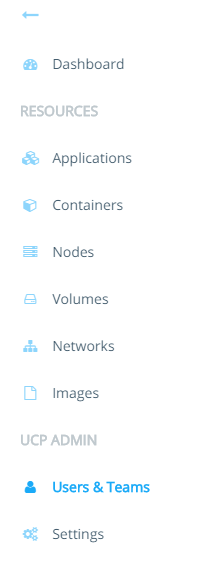
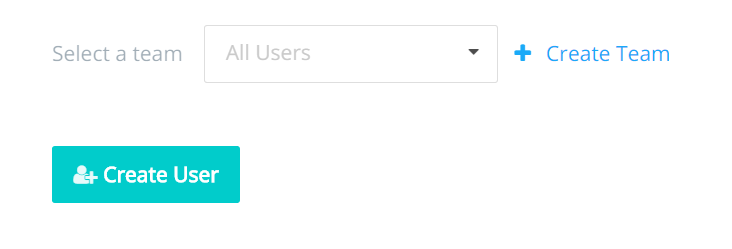
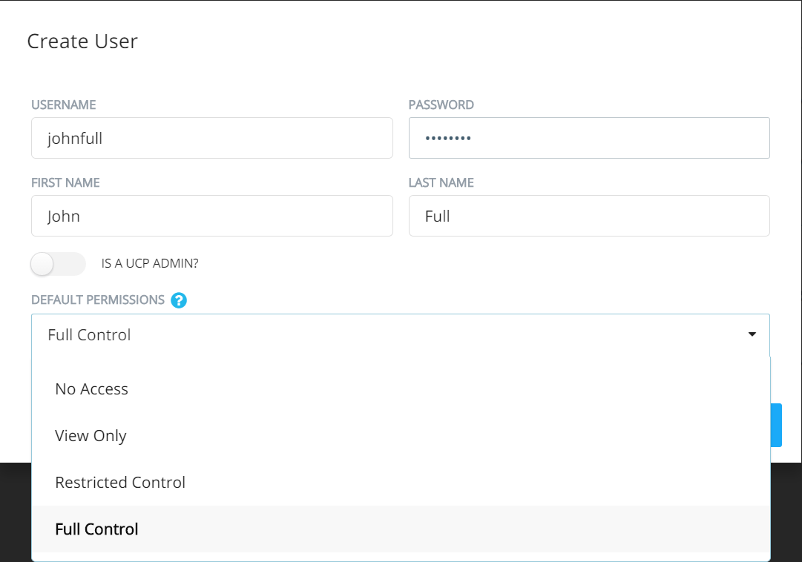
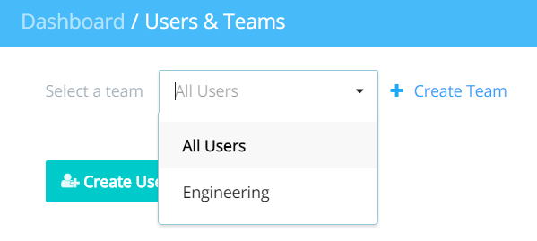
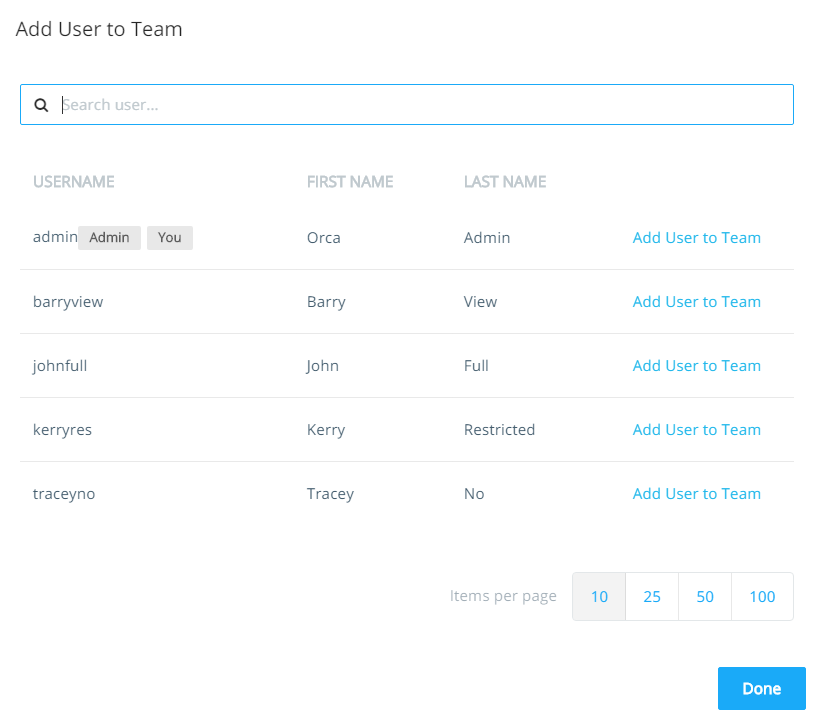
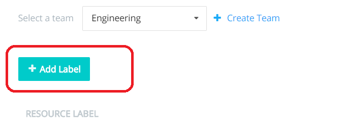
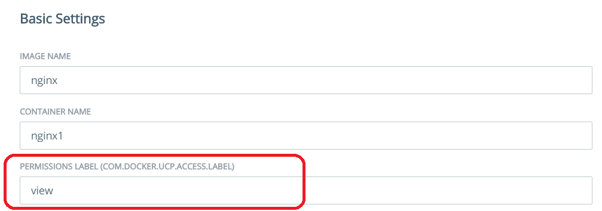

# Task 1 - Create Users and Teams

## Pre-requisites

- UCP installed

## Step 1 - Create users

1. Create 4 user accounts with the following setup:

| Username   | First Name   | Last Name  | Role               |
| :--------- | :----------- | :--------- | :----------------- |
| johnfull   | John         | Full       | Full Control       |
| kerryres   | Kerry        | Restricted | Restricted Control | 
| barryview  | Barry        | View       | View Only          |
| traceyno   | Tracey       | No         | No access          |

   To create a user account, click on **Users and Teams** on the left navigation. Then click the **Create User** button on the page.
   
   
   
   
   
   Let's create our user "John Full" first. We fill out the details on the form and select **Full Control** on the **Default Permissions** dropdown.
   
   
   
   Once you have created the user "John Full", repeat the procedure to create the other users indicated on the table.	
   

## Step 2 - Create a team

1. Create a team called **Engineering**

   Click on the ** + Create Team** button on the top. This opens up the dialog window.
   
   Specify **Engineering** as the team name and **Managed** as the type.
   
   
   
2. Add all 4 users to the team
 
   Use the  dropdown list at the top to select the **Engineering** team.
   
   
   
   Click on the **Add User to Team** button. On the dialogue window, click the **Add User to Team** link on the right side for each of the four users
   you have created. Do not add yourself to the team.
   
   
   
3. Create three resources labels for the team with the following details

| Resource Label   |   Role               |
| :-------------   |   :------------------|
| view             |   View Only          |
| restricted       |   Restricted Control |
| run              |   Full Control       |
   To create a resource label, first select the **Engineering** team that you have just setup, then click the **Permissions** tab on the right hand side.
   
   
   
   Click the **Add Label** button and create a label called **view** with the role of **View Only**
   
   
   
   
   
## Step 3 - Run some containers

1. Run an NGINX container using the ‘view’ label. You need to fill out the **Permissions Label** field. 

   
   
2. Run a few more containers **without** using any label

   In the next exercise we will explore the implications of running containers with these labels.
   
   
   
   
   
   
   
   