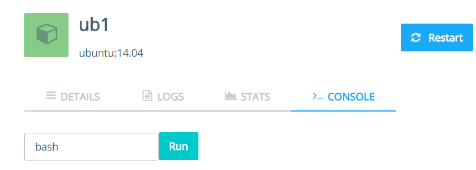
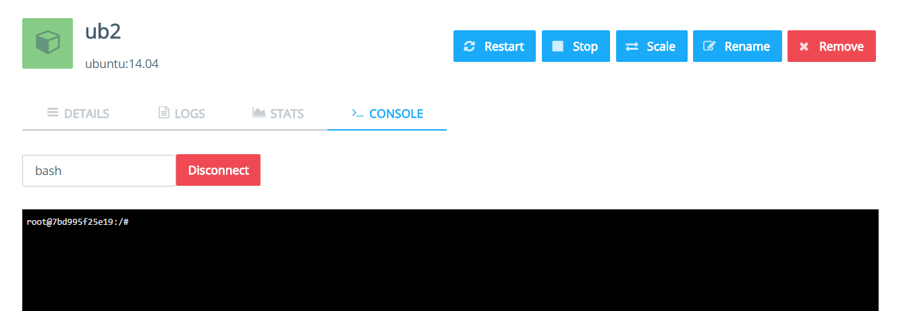

# Task 2 - Test User Access

## Pre-requisites 

- Completed Task 1

## Step 1 - Test team labels

1. Logout of UCP and log back in as the user "John"
2. Click on the containers link. Confirm that you can only see the NGINX container with the view label.
   
   If you click on the container details, you should be able to seet the "view" label listed in the Labels section

   
   
3. Run an Ubuntu container, and specify “view” in the Permissions Label field
4. Run another Ubuntu container but this time specify the “restricted” label field. Give the container the name `ub1`
5. Run another Ubuntu container but this time specify the “run” label field. Give the container the name `ub2`
6. What was your observation about each label?

   What you should have observed was that when trying to use the "view" label, you get an Access Denied error. When using the "restricted" or
   "run" label, you are able to launch the container. The reason for this is because, the view label in the "Engineering" team is associated with the 
   "View Only" permission. This permission does not permit you to run containers, whereas the "restricted" and "full control" permissions do.
   

## Step 2 - Test Container Access

1. Click on the container `ub1`. Then click the console tab on the top navigation bar.

   
   
2. Click on the "Run" button with "bash" specified in the field

   This feature is the GUI equivalent of running a `docker exec` command. In this case, we want to execute a `bash` terminal on the container
   
3. You will get an error message saying **Error attempting to open exec session**. Why do you think this is the case?

4. Now try the same thing with the `ub2` container. 

   This time, the bash terminal will launch successfully. Why do you think this is the case? 

   
   
5. Download the client bundle for user `John`. Unzip it to a folder on your PC or Mac

6. Connect to UCP using the client bundle

   The following example was run on a Windows machine using `Git bash` as the terminal

   ```
   johnny@JT MINGW64 /c/Docker/ucp_client_bundles/ucp-bundle-johnfull
   $ ls
   ca.pem  cert.pem  cert.pub  env.cmd  env.ps1  env.sh  key.pem

   johnny@JT MINGW64 /c/Docker/ucp_client_bundles/ucp-bundle-johnfull
   $ source env.sh
   ```
   
7. Run `docker ps` to list out the containers. 
 
   You should be able to see three containers:
   - `nginx1`
   - `ub1`
   - `ub2`

   ```
   johnny@JT MINGW64 /c/Docker/ucp_client_bundles/ucp-bundle-johnfull
   $ docker ps
   CONTAINER ID        IMAGE               COMMAND                  CREATED             STATUS              PORTS               NAMES
   7bd995f25e19        ubuntu:14.04        "/bin/bash"              32 minutes ago      Up 32 minutes                           ucp-node-0/ub2
   340c1b490389        ubuntu:14.04        "/bin/bash"              33 minutes ago      Up 32 minutes                           ucp-node-1/ub1
   133dc8bd4065        nginx               "nginx -g 'daemon off"   39 minutes ago      Up 38 minutes       80/tcp, 443/tcp     ucp-node-1/nginx1
   ```
   
8. Run `docker exec` to open a `bash` terminal on the `ub2` container

   The command we need to run is:
   `$ docker exec -it ub1 bash`
   
   This will result in an "Access Denied" error because if you remember, the `ub1` container was run with the `restricted` label, which maps to our "restricted" 
   permission in the Engineering team. 
   
   **Note:** The follow example was run on a Windows `CMD` terminal.
   
   ```
   C:\Docker\ucp_client_bundles\ucp-bundle-johnfull>docker exec -it ub1 bash
   Error response from daemon: access denied
   ```
   
9. Repeat the same process but for container `ub2`

   This time it will work because our `ub2` container was run using the "run" label, which corresponded to the "Full Control" permission
   
   ```
   C:\Docker\ucp_client_bundles\ucp-bundle-johnfull>docker exec -it ub2 bash
   root@7bd995f25e19:/# ls
   bin  boot  dev  etc  home  lib  lib64  media  mnt  opt  proc  root  run  sbin  srv  sys  tmp  usr  var
   root@7bd995f25e19:/#
   ```
   
## Step 3 - Test Admin access

1. Logout of UCP as "John" and log back in as the "Admin" user
2. Click on "Containers" and open up the `ub1` container
3. Click the "Console" tab and then click the "Run" button to run a `bash` terminal.

   Despite the fact that our `ub` container is running on the "Restricted" permission, the admin user can still perform a `docker exec` operation against the 
   container. This is because Admin users have full access, regardless of the permissions being applied.

4. Download the Admin user's client bundle and unzip to a folder of your choice.
5. Connect to UCP using the client bundle. 
6. Run `docker ps` and note down how many containers you can see.
   
   You should be able to see five containers. There's the `ub1` and `ub2` container that were launched in Step 1 plus the three containers from Task 1. 
   Previously as "John" we could only see three containers. This is because as the Admin user, we launch a few containers without any labels on them. These
   containers are only visible to other Admin users. Non admin users can only see the containers that are visible to their teams. 
   
   ```
   C:\Docker\ucp_client_bundles\ucp-bundle-admin>docker ps
   CONTAINER ID        IMAGE               COMMAND                  CREATED             STATUS              PORTS               NAMES
   7bd995f25e19        ubuntu:14.04        "/bin/bash"              2 hours ago         Up 2 hours                              ucp-node-0/ub2
   340c1b490389        ubuntu:14.04        "/bin/bash"              2 hours ago         Up 2 hours                              ucp-node-1/ub1
   815313c0d7f3        nginx               "nginx -g 'daemon off"   2 hours ago         Up 2 hours          80/tcp, 443/tcp     ucp-node-0/nginx3
   133dc8bd4065        nginx               "nginx -g 'daemon off"   2 hours ago         Up 2 hours          80/tcp, 443/tcp     ucp-node-1/nginx1
   a12ad5f72598        nginx               "nginx -g 'daemon off"   2 hours ago         Up 2 hours          80/tcp, 443/tcp     ucp-node-0/nginx2
   ```
   
7. Run `docker exec` and open a `bash` terminal to the `ub` container

   The operation should succeed because we are now connected to UCP as the Admin user. 
   
   ```
   C:\Docker\ucp_client_bundles\ucp-bundle-admin>docker exec -it ub1 bash
   root@340c1b490389:/#
   ```
   
## Step 4 - Access to other resources

1. Logout of UCP as the admin user and log back in at "John"
2. Click on the **Images** link and pull the `hello-world` image 
3. Click on the **Networks** link and create a Network called `johns-net`

From those steps, we can observe that the user **John Full**, who has the **Full Access** default permission, is able to pull images and create networks. Thus
John has access to the other UCP resources.

4. Logout of UCP as **John** and log back in as **Kerry**
5. Click on the **Images** link and pull the `ubuntu:15.04` image 
6. Click on the **Networks** link and create a Network called `kerry-net`

Similar  to **John**. Our user **Kerry** can do all the same actions, despite only having the **Restricted Access** default permission

7. Logout of UCP as **Kerry** and log back in as **Barry**
8. Click on the **Images** link and pull the `busybox` image 

   You may notice that the operation hangs. This is because our user **Barry** only has the **View Only** default permission, which prevents operations such
   as pulling images.
   
9. Click on the **Networks** link and create a Network called `barry-net` 

   You will get an **Access Denied** error message because of insufficient permissions.
   
10. Logout of UCP as **Barry** and login as **Tracey**
11. Look at the left navigation bar and notice that there are only three resources available
   - Applications
   - Containers
   - Nodes
   
   This is because **Tracey** has the default permission of **No Access*. This means she should not have access to any resources. However, as Tracey is part 
   of the **Engineering** team, she has access to the containers that are available to the team.
  
  


   