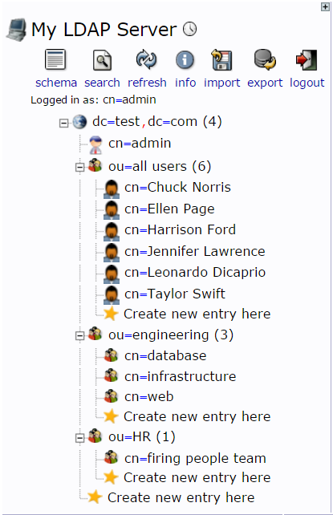
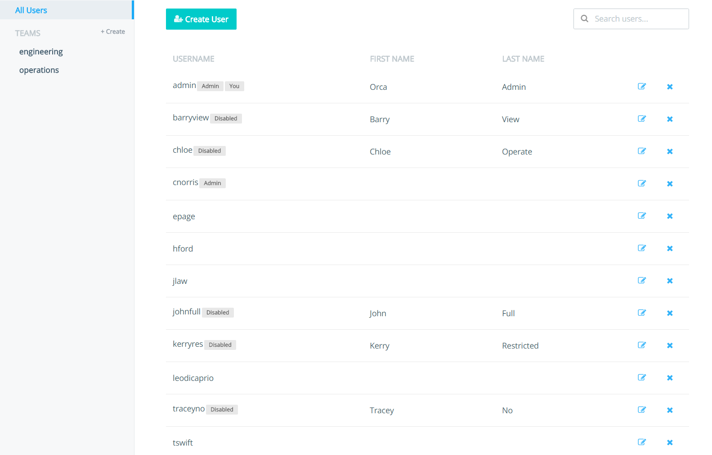

# Task 4 - User Management with LDAP

## Pre-requisites
- Pre-configured LDAP server with users and groups setup. Your instructor will provide you with details.
- Basic understanding of LDAP structure

## Step 1 - Examine the LDAP server

1. Open a browser and go to http://LDAP_SERVER/phpldapadmin. LDAP_SERVER should be the domain name or public IP address of your LDAP node. This will open up the GUI for your LDAP server
2. Login to the server with the following credentials:

   **Login DN:** cn=admin,dc=test,dc=com
   **Password:** admin
   
3. Expand the left navigation bar and take note of the LDAP entries underneath `ou=all users`, `ou=engineering` and `ou=HR`

   
   
   In this setup, we have 6 users.
   
## Step 2 - Integrate UCP and LDAP

1. Login to UCP as the admin user
2. Go to the “Settings” page of UCP
3. Click on the Auth section and change the Method from “Built-in” to “LDAP”
4. Specify your LDAP server URL 
5. Disable the **Start TLS** button

   
   
6. For the rest of the form, fill in the following details.

| Field                     | Value            |
| :---------                | :-----------     |
| UCP Admin LDAP Username   | cnorris          |
| UCP Admin LDAP Password   | password         |
| Search Account DN         | cn=Chuck Norris,ou=all users,dc=test,dc=com |
| Search Account Password   | password  |
| User Base DN              | dc=test,dc=com |
| User login Attribute Name | uid |
| User Search Filter        | objectClass=inetOrgPerson |
| Default Permission        | Full Control |

## Step 3 - Test User Access

1. Click on **User and Teams** and check to see that all the users from our LDAP server are present. You will also notice that
   the previous users you created are now marked as **disabled**
   
   
2. Logout of UCP as the admin user. Try and log back in. What do you notice?

   Once UCP is integrated with LDAP, all user accounts will come from LDAP. **Managed** accounts that were previously setup in UCP will be disabled.
   
3. Login as the user `cnorris`. The password is `password`
4. Check to see that you have admin access on the account.

   The admin access is available because, in our LDAP configuration, we specified the `cnorris` account on the **UCP Admin LDAP Username** option.
   That option is to specify which LDAP user we want to become a UCP admin.

5. Disable the LDAP integration by switch the Authentication back to **Built-in**

   

   
