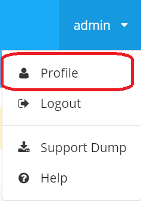
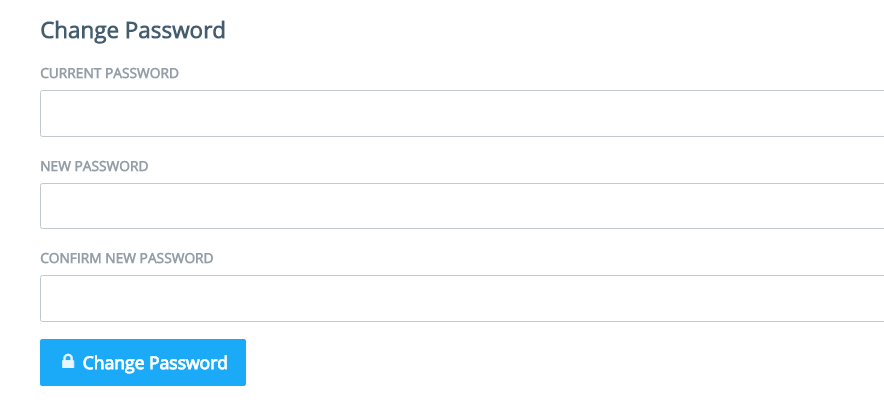

# Task - Troubleshooting - Password Recovery

## Pre-requisites
- UCP setup to used **Built-in** authentication (i.e. All users are created inside UCP). The methods detailed in this exercise do not work if UCP is integrated
  with LDAP for user authentication.

## Step 1 - Recovering admin passwords

UCP does not come with a password reset feature. Therefore, if a user forgets their password, they must send a request to the UCP admin to have a new password set.
This is an easy operation for an admin. 

However, what happens when an admin forgets their password and they are currently not logged in? The password to the default `admin` account can be recovered by 
deleting the admin user and then restarting the `ucp-controller`

1. If you have not already done so, go to the UCP **Authentication Settings** page and change the method back to **Built-in**.
2. Logout and log back into the Admin account. 
3. Change the password of the Admin account to something else.

   Click on **profile** from your user account dropdown list.
   
   
   
   Fill in the new password of your choice and click **Change Password**
     

4. Pretend that you have forgotten the password to your admin accout.
5. SSH into the UCP Controller node
6. Docker `exec` into the `KV` container

   If we do a quick `docker ps` we can see all our UCP containers.

   ```   
   CONTAINER ID        IMAGE                         COMMAND                  CREATED             STATUS              PORTS                                                                             NAMES
   212d237e609e        docker/ucp-controller:1.0.1   "/bin/controller serv"   28 hours ago        Up 2 hours          0.0.0.0:443->8080/tcp                                                             ucp-controller
   f63f1330014d        docker/ucp-cfssl:1.0.1        "/bin/cfssl serve -ad"   28 hours ago        Up 28 hours         8888/tcp, 0.0.0.0:12381->12381/tcp                                                ucp-cluster-root-ca
   e98447f066d1        docker/ucp-cfssl:1.0.1        "/bin/cfssl serve -ad"   28 hours ago        Up 28 hours         8888/tcp, 0.0.0.0:12382->12382/tcp                                                ucp-client-root-ca
   55456f6f9ac6        docker/ucp-swarm:1.0.1        "/swarm manage --tlsv"   28 hours ago        Up 28 hours         0.0.0.0:2376->2375/tcp                                                            ucp-swarm-manager
   edd8a73ac73a        docker/ucp-swarm:1.0.1        "/swarm join --discov"   28 hours ago        Up 28 hours         2375/tcp                                                                          ucp-swarm-join
   642f9919eadc        docker/ucp-proxy:1.0.1        "/bin/run"               28 hours ago        Up 28 hours         0.0.0.0:12376->2376/tcp                                                           ucp-proxy
   5f4c12bcc44e        docker/ucp-etcd:1.0.1         "/bin/etcd --data-dir"   28 hours ago        Up 2 hours          2380/tcp, 4001/tcp, 7001/tcp, 0.0.0.0:12380->12380/tcp, 0.0.0.0:12379->2379/tcp   ucp-kv
   ```
   
   The container we want to access is `ucp-kv`. This has the KV store that containers user profiles. We will run `docker exec` and start an `ash` process.
   
   ```
   ubuntu@ucp-controller:~$ docker exec -it ucp-kv ash
   / #
   ```
   
7. Delete the existing Admin account by running `curl -XDELETE -s --cacert /etc/docker/ssl/ca.pem --cert /etc/docker/ssl/cert.pem --key /etc/docker/ssl/key.pem -k https://127.0.0.1:2379/v2/keys/orca/v1/accounts/admin`

   ```
   / # curl -XDELETE -s --cacert /etc/docker/ssl/ca.pem --cert /etc/docker/ssl/cert.pem --key /etc/docker/ssl/key.pem -k https://127.0.0.1:2379/v2/keys/orca/v1/accounts/admin    
   {"action":"delete","node":{"key":"/orca/v1/accounts/admin","modifiedIndex":18636,"createdIndex":18565},"prevNode":{"key":"/orca/v1/accounts/admin",                                                                       "value":"{\"first_name\":\"Orca\",\"last_name\":\"Admin\",\"username\":\"admin\",\"password\":\"$2a$10$i2hMeduf9gWiUIxfH/5zjehsmTy9CWLQW1HEqu1lEPBI                                                                       IlK1hF06a\",\"admin\":true,\"public_keys\":[{\"label\":\"101.173.192.249:55732 Mozilla/5.0 (Windows NT 6.1; WOW64) AppleWebKit/537.36 (KHTML, like                                                                        Gecko) Chrome/49.0.2623.87 Safari/537.36\",\"public_key\":\"-----BEGIN PUBLIC KEY-----\\nMIIBIjANBgkqhkiG9w0BAQEFAAOCAQ8AMIIBCgKCAQEA2p+7fHEqLVjaEx                                                                       Wp8uV5\\nFUHbzrbzExKMxf8Xuthx0ZuRhgkLJwdh/ac5WEz/flepkR+6O2ie9dBHWSwXUmzw\\n16y9L/hqRCTMNr4TrU2x7TCQYp/c+eNp0gAYe0G9ZonBUtD7lEPNViKi4I3XJstU\\n/WaL                                                                       Q6tBrkpxBIs8LoEalLMBp0N9UMRJnm75+5Ka65Ei1ou7QWoZZbCEp6lyxfop\\nJa+UTwEa7nru1cnTqE4ET7ZFNMx/ZraUuL/zAmtvw+0fwLGRQ4JC9cadACKF/dYw\\nWk4QKao7BlyKJfIJX                                                                       iPIspvZIfSGdjPoSGTQ7OB5xxK6h1PukTFE41e/d1IRfTVp\\nFQIDAQAB\\n-----END PUBLIC KEY-----\"}],\"role\":0}","modifiedIndex":18565,"createdIndex":18565}}
   / #
   ```

8. Restart the UCP Controller container.

   ```
   ubuntu@ucp-controller:~$ docker restart ucp-controller
   ucp-controller
   ```
   
   When you restart the `ucp-controller`, if it does not find an Admin account, it will automatically re-create it and set the default password 
   of "orca"
   
9. Log back into your Admin account using the new password "orca"
   
   
   
   
   